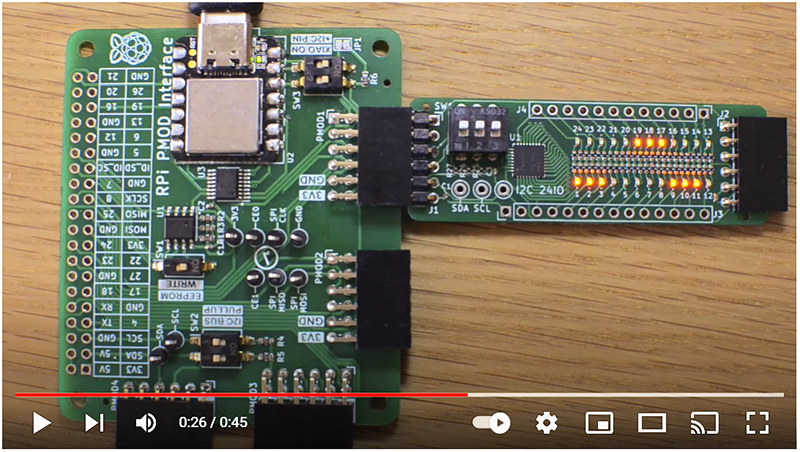

## XIAO-PMOD1-24IODEMO

Arduino Sketch for designs based on the I2C 24-bit digital expander IC Texas Instruments TCA6424A.
Implemented and tested on a PMOD2RPI interface board with a Seeeduino XIAO (Cortex M0+) and a I2C24IO PMOD module. 

### Usage

Running the sketch will output various LED patterns that indicate the IO signal status:

1. ON/OFF for all pins on the module
2. Moving a single bit through each of the 24 pins
3. Moving 3 bits, one for each of the 3 output ports
4. Increment pins from 0 until all port pins are ON/OFF
5. Moving 6 bits, two for each of the 3 output ports
6. Alternate the level for neighporing pins ON/OFF

