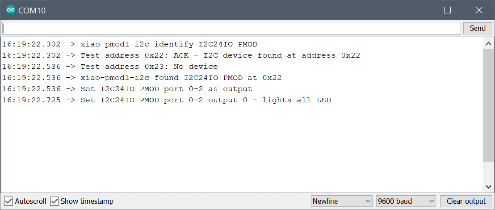

## XIAO-PMOD1-I2C24IO

Arduino Sketch for designs based on the I2C 24-bit digital expander IC Texas Instruments TCA6424A.
Implemented and tested on a PMOD2RPI interface board with a Seeeduino XIAO (Cortex M0+) and a I2C24IO PMOD module. 

### Usage

Running the sketch will output the following to the serial monitor:

PMOD2RPI interface board with a Seeeduino XIAO (Cortex M0+) and a I2C24IO PMOD module:

