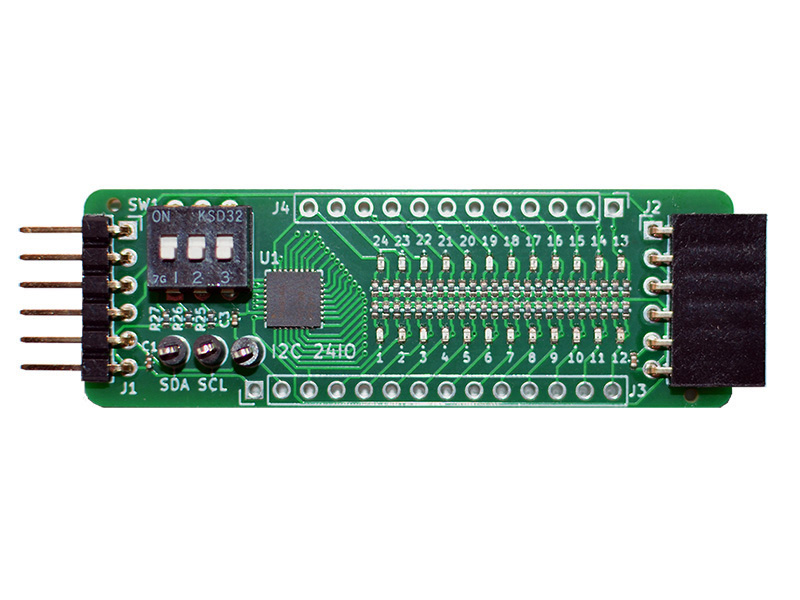

## I2C24IO PMOD

 

### Description



This project is a 24-bit digital IO expander module, using the Texas Instruments TCA6424A circuit utilizing I2C. The design is available with a Type-6 or Type-6A compatible I2C PMOD compatible connector interface per open PMOD interface standard v1.3.1 by Digilent Inc. PMOD (peripheral module interface) standardizes connectivity with FPGA or microcontroller development boards.

In this module, 24 IO pins are controlled through the serial I2C protocol. For each individual IO pin, a corresponding LED displays its current status with negative logic. A pins logic level '0' lights up the LED, while level '1' turns it off. To fit all IO pins on a reasonably small PMOD, 0402-size SMD components have been selected. DIP switches enable I2C pull-up resistors if needed, and change the I2C address between 0x22 and 0x23. Two modules can be chained for a total of 48 IO signals. Three Testpoints can be fitted for I2C bus troubleshooting.

See also http://fpga.fm4dd.com/

### Schematic

Type-6 v1.1 variant:

[](images/t6-v11/i2c24io-t6-schema-v11.png)

Type-6 Physical Dimensions: 60 mm x 20.3 mm

### Hardware Release

|Type     | Version | Gerber | Schema |
|---------|---------|--------|--------|
|Type-6   | 1.0     |[20210906-pmod-i2c24io-t6-gerber-v10.zip](release/t6-v10/20210906-pmod-i2c24io-t6-gerber-v10.zip) | [20210906-pmod-i2c24io-t6-schema-v10.pdf](images/t6-v11/20210906-pmod-i2c24io-t6-schema-v10.pdf) |
|Type-6   |1.1      |[20210919-pmod-i2c24io-t6-gerber-v11.zip](release/t6-v11/20210919-pmod-i2c24io-t6-gerber-v11.zip) | [20210919-pmod-i2c24io-t6-schema-v11.pdf](release/t6-v11/20210919-pmod-i2c24io-t6-schema-v11.pdf)
|Type-6A  |1.1      |[20210919-pmod-i2c24io-t6a-gerber-v11.zip](release/t6a-v11/20210919-pmod-i2c24io-t6a-gerber-v11.zip) | [20210919-pmod-i2c24io-t6a-schema-v11.pdf](release/t6a-v11/20210919-pmod-i2c24io-t6a-schema-v11.pdf)

Type-6A v1.1 variant:

[](images/t6a-v11/i2c24io-t6a-render.png)

Type-6A Physical Dimensions: 62.5 mm x 21.7 mm

### Module Pin Assignments

Type 6:
| Pin | Signal | Description |
|-----|--------|-------------|
| 1   | Reset  | TCA6424A Reset Pin |
| 2   | Int    | TCA6424A Interrupt Pin |
| 3   | SCL    | I2C Clock Signal |
| 4   | SDA    | I2C Data Signal |
| 5   | GND    | Power Supply Ground |
| 6   | VCC    | Power Supply (3.3V) |

Type 6A (Pin 1-6 same as Type 6)

| Pin | Signal | Description |
|-----|--------|-------------|
| 7   | IO1    | IO signal 1 |
| 8   | IO2    | IO signal 2 |
| 9   | IO3    | IO signal 3 |
| 10  | IO4    | IO signal 4 |
| 11  | GND    | Power Supply Ground |
| 12  | VCC    | Power Supply (3.3V) |

Note: all pin signals are passed from the module pin header to the opposite pin socket, allowing to chain another I2C module to the I2C bus.


#### Rasperry Pi I2C Discovery

First we set Reset pin 'high' to enable circuit operation by exiting the reset state. The gpioset command here is part of the 'gpiod' pin control program and library, installed with 'sudo apt install gpiod'.
```
pi@pi-ms05:~/pmod2rpi/pi-tca6424a $ gpioset gpiochip0 22=1
```
Now we can see the IO expander circuit under address 0x22 (address pin = '1'), or 0x23 (address pin = '0').
```
pi@pi-ms05:~/pmod2rpi/pi-tca6424a $ i2cdetect -y 1
     0  1  2  3  4  5  6  7  8  9  a  b  c  d  e  f
00:          -- -- -- -- -- -- -- -- -- -- -- -- --
10: -- -- -- -- -- -- -- -- -- -- -- -- -- -- -- --
20: -- -- 22 -- -- -- -- -- -- -- -- -- -- -- -- --
...
```

Note: From I2C24IO module hardware version 1.1, two additional 10K pull-up resistors (R28,29) have been fitted to auto-enable the circuit, which eliminates the need to explicitly configure the 'Reset' pin.

### Example Code

| Platform | Folder | Description |
|----------|--------|-------------|
|Raspberry Pi |[pi-tca6424a](examples/pi-tca6424a)   | I2C module driver 'C' program to control the expander 24 IO output pins individually, and as a set |
|Arduino      |[xiao-pmod1-i2c24io](examples/xiao-pmod1-i2c24io)   | Tests I2C ports 0x22 and 0x23. If a module is found, all IO pins are set as 'output=0' (lighting up all LED) |
|Arduino      |[xiao-pmod1-24iodemo](examples/xiao-pmod1-24iodemo)   | Creates a lightshow demo by rotating binary patterns over the 24 IO pins, lighting up connected LEDs |

I2C24IO PMOD connected to the RPi PMOD Interface board connector PMOD1, running the "xiao-pmod1-i2c24io" example program on the Seeeduino XIAO (Cortex M0):


